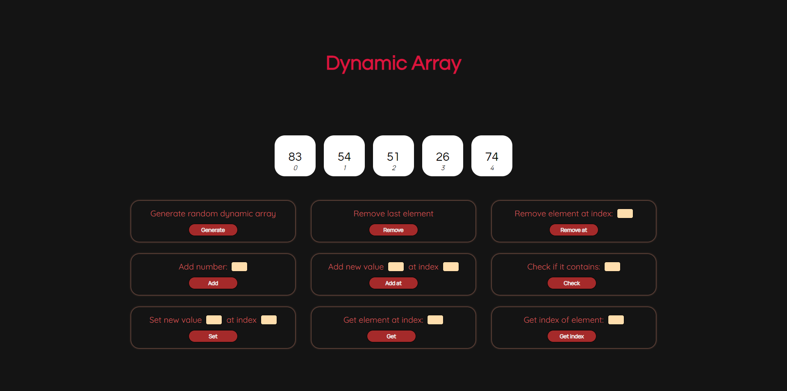

# Visualizing Dynamic Arrays

This is a a simple website which helps in visualizing some of the Dynamic Array functionalities.

## Functionalities implemented:
1. add(element)
2. addAt(index, element)
3. set(index, element)
4. removeAt(index)
5. remove()
6. contains(element)
7. get(index)
8. indexOf(element)

## Project structure:
- src/index.html
- src/style.css
- src/script.js : holds the Dynamic Array data structure built using the array type offered in javascript (reference type), and the animations
- src/control.js : handles mouse click events performed by the user in each button

## Frameworks used:
- jQuery (handling events, manipulating DOM) 
- GSAP (animations)
